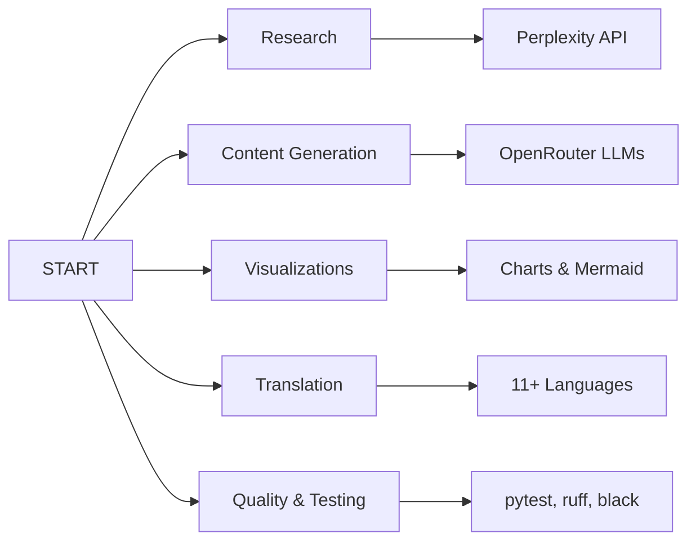
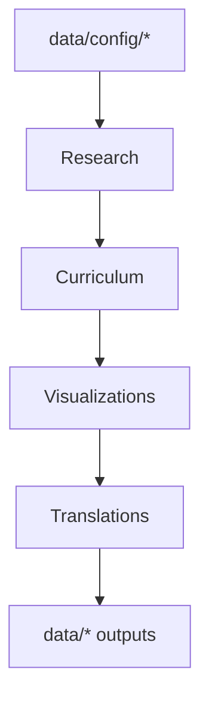

# START: Scalable, Tailored Active-inference Research & Training

[](https://www.python.org/downloads/)
[](https://creativecommons.org/licenses/by-sa/4.0/)
[](https://github.com/psf/black)

> **An advanced AI-powered system for creating personalized Active Inference and Free Energy Principle curricula**
> Quick links: [activeinference.institute](https://www.activeinference.institute/) • [activities.activeinference.institute](https://activities.activeinference.institute/) • [x.com/InferenceActive](https://x.com/InferenceActive) • [discord.activeinference.institute](https://discord.activeinference.institute/) • [donate.activeinference.institute](http://donate.activeinference.institute/) • [youtube.com/c/ActiveInference](https://www.youtube.com/c/ActiveInference/) • [video.activeinference.institute](https://video.activeinference.institute/)

START combines real-time research capabilities with sophisticated content generation to produce professional-grade, personalized educational materials for Active Inference and the Free Energy Principle. The system integrates multiple APIs, comprehensive prompt engineering, and multilingual capabilities to create world-class curricula tailored to specific domains and individual learners.

> 📌 Start here: **[here.md](here.md)** — interactive landing for the full experience. Also see the **[Docs Hub](docs/README.md)** and this **README** for GitHub-oriented navigation.

## 🌐 Documentation (Live)

- GitHub Pages site: [activeinferenceinstitute.github.io/Start](https://activeinferenceinstitute.github.io/Start/)

## 🔗 Quick Links

- **Docs Hub**: [docs/README.md](docs/README.md)
- **Start Here (interactive)**: [here.md](here.md)
- **Getting Started**: [docs/getting_started.md](docs/getting_started.md)
- **Environment Setup**: [docs/environment.md](docs/environment.md)
- **Pipeline Overview**: [docs/pipeline.md](docs/pipeline.md)
- **Testing Guide**: [docs/TESTING.md](docs/TESTING.md)
- **Configuration Reference**: [docs/configuration.md](docs/configuration.md)
- **Examples & Outputs**: [docs/examples.md](docs/examples.md)
- **Clone Management**: [docs/clones.md](docs/clones.md)
- **Conventions**: [docs/conventions.md](docs/conventions.md)
- **User Usage Guide (GitHub)**: https://github.com/ActiveInferenceInstitute/Start/blob/main/learning/curriculum_creation/USAGE_GUIDE.md
- **API Integration (GitHub)**: https://github.com/ActiveInferenceInstitute/Start/blob/main/learning/curriculum_creation/README.md

## ▶️ Run the Experience

- **Matrix Terminal UI** (end-to-end interactive):

```bash
./run.sh
```

- **Documentation Website** (serve, build, deploy):

```bash
# Serve locally with live reload
./run_docs.sh --serve

# Build static site to ./site and open it
./run_docs.sh --build

# Deploy to GitHub Pages and open the URL
./run_docs.sh --deploy
```

## 📚 Documentation Overview

- High-level docs live under `docs/`. Each page is modular and links to deeper guides.
- Start with the **[Docs Hub](docs/README.md)**, then dive into:
  - **[Getting Started](docs/getting_started.md)** — install, first research session, generate outputs
  - **[Environment](docs/environment.md)** — prerequisites, API keys, CI parity
  - **[Pipeline](docs/pipeline.md)** — architecture, stages, data layout
  - **[Testing](docs/TESTING.md)** — policies, markers, offline/CI rules
  - **[Configuration](docs/configuration.md)** — YAML schemas and CLI usage
  - **[Examples](docs/examples.md)** — where to find generated artifacts

## 🚀 **Key Features**



### 🔍 **Intelligent Research**

- **Real-time Domain Analysis**: Live research using Perplexity API for current industry insights
- **Personalized Learner Profiling**: In-depth analysis of individual learning needs and backgrounds  
- **16+ Professional Domains**: Life sciences, technology, business, healthcare, education, and more
- **Configuration-Driven**: YAML-based target management with priority and category filtering
- **Enhanced Error Handling**: Robust validation and retry mechanisms for reliable operation

### ✍️ **Advanced Content Generation** 

- **Professional-Grade Curricula**: 40-60 hour structured learning programs
- **Comprehensive Modules**: 3-5 hour learning units with integrated assessments
- **5,000-8,000 Word Analyses**: Deep personalization and domain integration
- **Enhanced Prompts**: 6-9 section frameworks with validation and quality assurance
- **Content Quality Validation**: Automatic checking for completeness and consistency

### 📊 **Rich Visualizations**

- **Data Charts**: PNG visualizations of curriculum metrics and learning analytics
- **Process Diagrams**: Mermaid flowcharts showing curriculum structure and pathways
- **Interactive Elements**: Visual learning aids and conceptual frameworks
- **Metrics Dashboard**: Comprehensive curriculum analysis and reporting

### 🌍 **Multilingual Excellence**

- **11+ Languages**: Chinese, Spanish, Arabic, Hindi, French, Japanese, Russian, Swahili, Tagalog, and custom languages
- **Cultural Adaptation**: Full localization beyond literal translation
- **Professional Quality**: Native-speaker level fluency with technical accuracy
- **Smart Language Handling**: Flexible language support with custom language warnings

### 🧪 **Comprehensive Testing & Quality Assurance**

- **375+ Test Cases**: Extensive unit and integration test coverage
- **API Validation**: Robust testing of all external API integrations
- **Error Scenario Coverage**: Comprehensive testing of edge cases and error conditions
- **Continuous Integration**: Automated testing pipeline ensuring reliability

## 📦 **Core Pipeline Scripts**

### Configuration-Based Research

See `docs/getting_started.md` for full command lists and script paths.

### Learn More

- Docs Hub: `docs/README.md`
- Getting Started: `docs/getting_started.md`
- Configuration: `docs/configuration.md`
- Examples & Outputs: `docs/examples.md`
- Pipeline & Architecture: `docs/pipeline.md`
- Environment & CI: `docs/environment.md`
- Testing Policy: `docs/TESTING.md`
- Clone Management: `docs/clones.md`

## 🛠️ **Quick Installation**

### Prerequisites
- Python 3.10+ (3.11+ recommended)
- [uv package manager](https://astral.sh/uv)
- Perplexity API key for research
- OpenRouter API key for content generation

### Installation Steps
```bash
# Install uv package manager
curl -LsSf https://astral.sh/uv/install.sh | sh

# Clone and set up project
git clone https://github.com/ActiveInferenceInstitute/Start.git
cd Start

# Install dependencies
uv sync --all-extras --dev

# Download language models
uv run python -m spacy download en_core_web_sm

# Configure API keys
cp .env.example .env
$EDITOR .env  # Add PERPLEXITY_API_KEY and OPENROUTER_API_KEY

# Verify installation
uv run pytest -q
uv run ruff check .
uv run black --check .
```

## 🎯 **Getting Started**

See `docs/getting_started.md` for first-run commands, generation steps, and exploring outputs.

## ⚙️ **Configuration System**

See `docs/configuration.md` for YAML examples and CLI usage.

## 📈 **Generated Content Quality**

### Research Analysis (Enhanced with new prompts)
- **Domain Reports**: 3,000-5,000 words of professional landscape analysis
- **Entity Profiles**: 5,000-8,000 words of personalized learning strategies
- **Real-time Data**: Current industry insights via Perplexity API
- **Evidence-Based**: Grounded in current research and best practices

### Curriculum Content (Professional-grade)
- **Structured Programs**: 40-60 hour comprehensive learning experiences
- **Modular Design**: 6-9 section frameworks with integrated assessments
- **Practical Applications**: Real-world case studies and hands-on exercises
- **Professional Integration**: Career development and workplace applications

### Multilingual Adaptations (Cultural excellence)
- **Full Localization**: Examples adapted to target cultures
- **Technical Accuracy**: Precise translation of scientific terms
- **Educational Quality**: Maintains pedagogical effectiveness across languages
- **Native Fluency**: Professional-quality content for each target language

## 🏗️ **System Architecture**



See `docs/pipeline.md` for architecture, templates, and data flow.

### Prompt Template System
```
data/prompts/
├── research_domain_analysis.md     # 6-section domain framework (3K-5K words)
├── research_domain_curriculum.md   # 9-section curriculum generation (40-60 hours)
├── research_entity.md              # 6-section personalization (5K-8K words)
├── curriculum_section.md           # Comprehensive module creation (3-5 hours)
└── translation.md                  # 7-section multilingual framework
```

### Quality Assurance Framework
- **Comprehensive Testing**: pytest with TDD approach
- **Code Quality**: ruff linting and black formatting  
- **API Integration**: Real-time validation with Perplexity and OpenRouter
- **Content Standards**: Professional-grade educational material validation

## 📊 **Example Outputs**

See `docs/examples.md` for example outputs and paths.

## 🎯 **Use Cases & Applications**

### Educational Institutions
- **University Courses**: Neuroscience, psychology, AI program curricula
- **Professional Development**: Corporate training for data science, healthcare, management
- **Research Training**: Graduate-level courses with theory and implementation

### Individual Learning  
- **Self-Directed Study**: Personalized curricula based on background and goals
- **Career Transition**: Bridge existing expertise to Active Inference applications
- **Academic Research**: Foundation for thesis work and research projects

### Organizational Training
- **Technology Companies**: AI ethics, decision frameworks, intelligent systems
- **Healthcare Organizations**: Evidence-based practice, clinical decision support
- **Consulting Firms**: Advanced analytical frameworks, problem-solving methodologies

## 📚 **Comprehensive Documentation**

### 🚀 **Getting Started Guides**
- See the Docs Hub for the complete documentation: `docs/README.md`
- Environment Setup: `docs/environment.md`
- Pipeline Overview: `docs/pipeline.md`
- Usage Guide: `learning/curriculum_creation/USAGE_GUIDE.md`

### 🔧 **Technical References** 
- API Documentation: `learning/curriculum_creation/README.md`
- Configuration Reference & Docs Hub: `docs/README.md`
- Clone Management: `docs/clones.md`

### 📋 **Advanced Topics**
- **Prompt Engineering**: Custom templates in `data/prompts/`
- **Extension Development**: Adding new domains and entities
- **Integration Patterns**: Incorporating START into existing workflows

## 🤝 **Active Inference Ecosystem Integration**

- **Website**: [activeinference.institute](https://www.activeinference.institute/)
- **Activities**: [activities.activeinference.institute](https://activities.activeinference.institute/)
- **X (Twitter)**: [x.com/InferenceActive](https://x.com/InferenceActive)
- **Discord**: [discord.activeinference.institute](https://discord.activeinference.institute/)
- **Donate**: [donate.activeinference.institute](http://donate.activeinference.institute/)
- **YouTube**: [youtube.com/c/ActiveInference](https://www.youtube.com/c/ActiveInference/)
- **Livestreams**: [video.activeinference.institute](https://video.activeinference.institute/)

See also: implementation repos and knowledge resources in [docs/clones.md](docs/clones.md).

## 🔄 **Development Roadmap**

### Immediate Enhancements
- [ ] Expanded domain coverage (20+ professional fields)
- [ ] Enhanced visualization types (interactive diagrams, 3D models)
- [ ] Integration with learning management systems (LMS)
- [ ] Mobile-responsive curriculum formats

### Future Vision
- [ ] Real-time personalization based on learning progress
- [ ] Community-contributed domain and entity profiles  
- [ ] AR/VR learning platform integration
- [ ] Automated assessment and credentialing systems

## 🤝 **Contributing**

We welcome contributions! See our [Contributing Guide](CONTRIBUTING.md) for details on:

- Code style and development process
- Pull request procedure and review guidelines
- Community guidelines and communication
- Testing requirements and quality standards

### Development Workflow
```bash
# Set up development environment
uv sync --all-extras --dev

# Run quality checks
uv run pytest -q           # Test suite
uv run ruff check .        # Linting
uv run black --check .     # Formatting

# Development with proper Python path
export PYTHONPATH=$(pwd):$PYTHONPATH
```

## 🧪 **Development & Testing**

### Testing Framework
The project includes a comprehensive testing framework with 375+ test cases covering:
- **Unit Tests**: Individual component testing with proper mocking
- **Integration Tests**: End-to-end pipeline validation  
- **API Tests**: External service integration validation
- **Error Handling**: Edge cases and failure scenarios

### Running Tests
```bash
# Run full test suite
uv run pytest

# Run specific test categories  
uv run pytest -m "not integration"     # Skip integration tests
uv run pytest -m integration           # Only integration tests
uv run pytest tests/test_domain.py     # Specific test file

# Run with coverage
uv run pytest --cov=src --cov-report=html

# Set environment for GUI-free testing
export MPLBACKEND=Agg
uv run pytest
```

### Development Guidelines
- **Code Quality**: Black formatting, Ruff linting, comprehensive type hints
- **Testing**: Write tests for all new functionality with proper mocking
- **Documentation**: Include docstrings and update relevant docs
- **Error Handling**: Implement graceful degradation and user-friendly messages

### Project Structure
```
├── src/                    # Core system modules
│   ├── common/            # Shared utilities
│   ├── perplexity/        # API integrations  
│   ├── system/            # System utilities
│   └── terminal/          # CLI components
├── learning/              # Educational pipeline scripts
├── tests/                 # Test suite (375+ tests)
├── docs/                  # Documentation
│   ├── TESTING.md         # Testing guide
│   └── environment.md     # Setup instructions
└── data/                  # Generated content storage
```

For detailed testing information, see `docs/TESTING.md`.

## 📄 **License & Citation**

This work is licensed under a [Creative Commons Attribution-ShareAlike 4.0 International License](https://creativecommons.org/licenses/by-sa/4.0/) - see the [LICENSE](LICENSE) file for details.

### DOI & Archive
[](https://doi.org/10.5281/zenodo.17047617)

This repository is archived and citable via Zenodo: **10.5281/zenodo.17047619**

### Citation
If you use START in academic work, please cite:
```
Daniel Ari Friedman, & Active Inference Institute. (2025). 
ActiveInferenceInstitute/Start: v1 (v1). Zenodo. 
https://doi.org/10.5281/zenodo.17047617

START: Scalable, Tailored Active-inference Research & Training
Active Inference Institute (2024)
https://github.com/ActiveInferenceInstitute/Start
Licensed under Creative Commons Attribution-ShareAlike 4.0 International
```

## 🙏 **Acknowledgments**

- **Active Inference Institute** for foundational research and community support
- **Contributors** to pymdp, ActiveInference.jl, RxInfer.jl, and related implementation packages
- **Educational partners** providing feedback and validation for curriculum effectiveness
- **Open source community** for tools, libraries, and collaborative development

## 📬 **Contact & Support**

- **GitHub Issues**: [Project Issues](https://github.com/ActiveInferenceInstitute/Start/issues)
- **Community**: [Active Inference Institute](https://www.activeinference.institute/)
- **Email**: [blanket@activeinference.institute](mailto:blanket@activeinference.institute)

## 🌟 **Join the Community**

Together we're building tools to make Active Inference accessible and adaptable across domains, languages, and perspectives. **START** represents a new paradigm in AI-powered educational content creation - join us in making advanced neuroscience and cognitive science accessible to learners worldwide!

**[📚 Explore Documentation](docs/README.md) | [🚀 Get Started](#-quick-installation) | [🤝 Join Community](https://www.activeinference.institute/)**

## Institute Shortlinks (email-friendly)

- 2025: [2025.activeinference.institute](https://2025.activeinference.institute/)
- Active Blockference: [active-blockference.activeinference.institute](https://active-blockference.activeinference.institute)
- Activities: [activities.activeinference.institute](https://activities.activeinference.institute)
- Affordances: [affordances.activeinference.institute](https://affordances.activeinference.institute/)
- BoD: [bod.activeinference.institute](https://bod.activeinference.institute)
- Discord: [discord.activeinference.institute](https://discord.activeinference.institute)
- Donate: [donate.activeinference.institute](http://donate.activeinference.institute)
- Ecosystem: [ecosystem.activeinference.institute](https://ecosystem.activeinference.institute)
- EduActive: [eduactive.activeinference.institute](https://eduactive.activeinference.institute)
- Fellows: [fellows.activeinference.institute](https://fellows.activeinference.institute)
- Fellowship: [fellowship.activeinference.institute](https://fellowship.activeinference.institute)
- Intern: [intern.activeinference.institute](https://intern.activeinference.institute)
- Knowledge Engineering: [knowledge-engineering.activeinference.institute](https://knowledge-engineering.activeinference.institute)
- Measure: [measure.activeinference.institute](https://measure.activeinference.institute)
- Mentorship: [mentorship.activeinference.institute](https://mentorship.activeinference.institute/)
- Newsletter: [newsletter.activeinference.institute](https://newsletter.activeinference.institute)
- Obsidian: [obsidian.activeinference.institute](https://obsidian.activeinference.institute)
- Ontology: [ontology.activeinference.institute](https://ontology.activeinference.institute)
- Partnership: [partnership.activeinference.institute](https://partnership.activeinference.institute)
- Partnerships: [partnerships.activeinference.institute](https://partnerships.activeinference.institute)
- PayPal: [paypal.activeinference.institute](https://paypal.activeinference.institute)
- Prepare: [prepare.activeinference.institute](https://prepare.activeinference.institute)
- Projects: [projects.activeinference.institute](https://projects.activeinference.institute)
- ReInference: [reinference.activeinference.institute](https://reinference.activeinference.institute)
- RxInfer: [rxinfer.activeinference.institute](https://rxinfer.activeinference.institute)
- SAB: [sab.activeinference.institute](https://sab.activeinference.institute)
- Strategy: [strategy.activeinference.institute](https://strategy.activeinference.institute)
- Support: [support.activeinference.institute](https://support.activeinference.institute)
- Symposium: [symposium.activeinference.institute](https://symposium.activeinference.institute/)
- Textbook Group: [textbook-group.activeinference.institute](https://textbook-group.activeinference.institute)
- TNB: [tnb.activeinference.institute](https://tnb.activeinference.institute/)
- Video: [video.activeinference.institute](https://video.activeinference.institute)
- Volunteer: [volunteer.activeinference.institute](https://volunteer.activeinference.institute)
- Wave Hypothesis: [wave-hypothesis.activeinference.institute](https://wave-hypothesis.activeinference.institute/)
- Weekly: [weekly.activeinference.institute](https://weekly.activeinference.institute/)
- Welcome: [welcome.activeinference.institute](https://welcome.activeinference.institute)