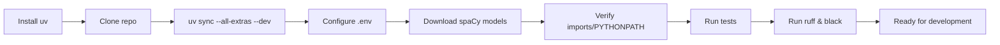
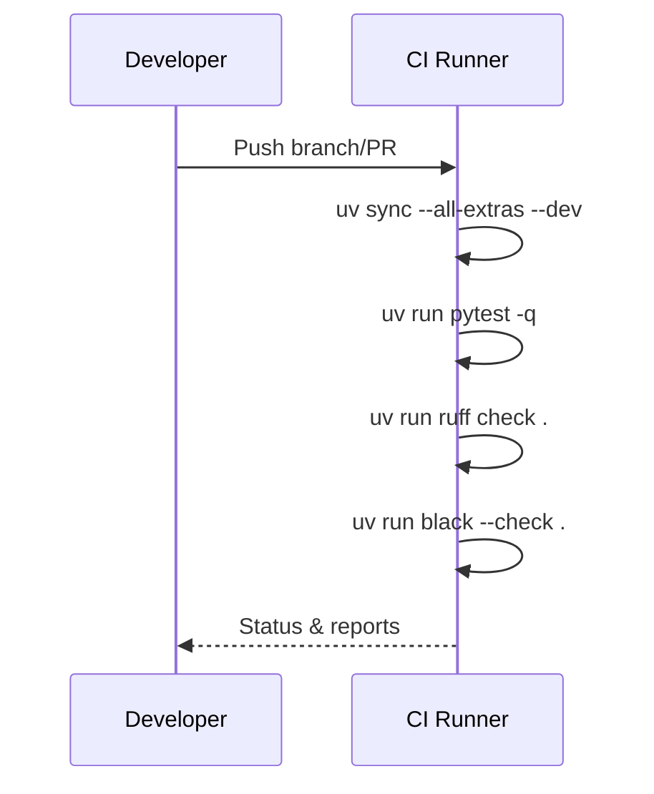

# Environment Setup & Development Guide

## Prerequisites

### System Requirements
- **Python 3.10+** (3.11+ recommended for optimal performance)
- **uv** package manager ([astral.sh/uv](https://astral.sh/uv))
- **Git** for repository management and cloning external resources
- **Internet connection** for API access (Perplexity, OpenRouter)

### API Access Requirements
- **Perplexity API** account and key for real-time research
- **OpenRouter API** account and key for advanced LLM-based content generation
- **Optional**: OpenAI API key for alternative LLM access

## Quick Installation



### 1. Install uv Package Manager
```bash
curl -LsSf https://astral.sh/uv/install.sh | sh
# or on macOS: brew install uv
```

### 2. Install Project Dependencies
```bash
# Install all dependencies including development tools
uv sync --all-extras --dev

# Install specific dependency groups
uv sync --extra visualization --extra translation --dev
```

### 3. Download Required Models
```bash
# spaCy model for natural language processing
uv run python -m spacy download en_core_web_sm

# Additional language models for multilingual support (optional)
uv run python -m spacy download fr_core_news_sm  # French
uv run python -m spacy download es_core_news_sm  # Spanish
```

## Configuration

### 1. Environment Variables Setup
```bash
# Copy the example environment file
cp .env.example .env

# Edit with your API keys and configuration
$EDITOR .env
```

### 2. Required Environment Variables
```bash
# Required API Keys
PERPLEXITY_API_KEY=your_perplexity_api_key_here
OPENROUTER_API_KEY=your_openrouter_api_key_here

# Optional API Keys
OPENAI_API_KEY=your_openai_api_key_here

# Default Model Configuration
PERPLEXITY_MODEL=llama-3.1-sonar-small-128k-online
OPENROUTER_MODEL=gpt-4o-mini-2024-07-18
OPENAI_MODEL=gpt-4o-mini
```

### 3. Configuration Files
The system uses YAML configuration files in `data/config/`:
- `entities.yaml` - Target learner profiles and research subjects
- `domains.yaml` - Professional domains for curriculum development  
- `languages.yaml` - Translation targets and language mappings

## Development Workflow

### Code Quality & Testing
```bash
# Run comprehensive test suite
uv run pytest -q

# Code linting and formatting
uv run ruff check .                    # Lint checking
uv run black --check .                 # Format checking
uv run black .                         # Auto-formatting

# Type checking (if configured)
uv run mypy src/
```

### Curriculum Pipeline Development
```bash
# Set Python path for development
export PYTHONPATH=/path/to/project:$PYTHONPATH

# Run curriculum creation scripts
cd learning/curriculum_creation/
uv run python 1_Research_Domain.py --help
uv run python 1_Research_Entity.py --priority high
```

### Testing API Integration
```bash
# Test Perplexity API connection
uv run python -c "
from src.perplexity.clients import build_perplexity_client
client = build_perplexity_client()
print('Perplexity API connection successful')
"

# Test OpenRouter API connection  
uv run python -c "
from src.perplexity.clients import build_openrouter_client
client = build_openrouter_client()
print('OpenRouter API connection successful')
"
```

## Project Structure

### Core Development Directories
```text
src/
├── common/                    # Shared utilities and infrastructure
│   ├── config.py             # Configuration management
│   ├── io.py                 # File I/O operations
│   ├── logging_utils.py      # Structured logging
│   ├── paths.py              # Path management
│   └── prompts.py            # Prompt template system
├── perplexity/               # Perplexity API integration
│   ├── clients.py            # API client management
│   ├── domain.py             # Domain research
│   ├── entity.py             # Entity/audience research
│   ├── curriculum.py         # Curriculum generation
│   └── translation.py        # Multilingual content
├── config/                   # Configuration utilities
└── visualization/            # Chart and diagram generation
```

### Data and Configuration
```text
data/
├── config/                   # YAML configuration files
├── prompts/                  # LLM prompt templates
├── audience_research/        # Generated entity research
├── domain_research/          # Generated domain analysis
├── written_curriculums/      # Generated curriculum content
├── translated_curriculums/   # Multilingual versions
└── visualizations/           # Charts and diagrams
```

### Learning and Documentation
```text
learning/curriculum_creation/ # Main curriculum creation scripts
docs/                        # Comprehensive documentation
tests/                       # Test suite and fixtures
```

## Advanced Setup

### Performance Optimization
```bash
# Enable faster JSON processing
pip install orjson

# GPU acceleration for visualization (optional)
pip install matplotlib[gpu]

# Parallel processing enhancements
pip install joblib multiprocessing-logging
```

### Development Tools
```bash
# Install additional development tools
uv add --dev pre-commit jupyter lab ipython

# Set up pre-commit hooks
pre-commit install
```

### IDE Integration
- **VS Code**: Install Python, Pylance, and Black formatter extensions
- **PyCharm**: Configure interpreters to use uv virtual environment
- **Jupyter**: Use `uv run jupyter lab` for notebook development

## Troubleshooting

### Common Issues

#### API Key Issues
```bash
# Verify API keys are loaded
uv run python -c "import os; print('PERPLEXITY_API_KEY:', bool(os.getenv('PERPLEXITY_API_KEY')))"
```

#### Import Errors
```bash
# Ensure PYTHONPATH is set correctly
export PYTHONPATH=$(pwd):$PYTHONPATH
uv run python -c "import src.common.paths; print('Import successful')"
```

#### Dependency Issues
```bash
# Force reinstall dependencies
uv sync --reinstall

# Check for conflicts
uv tree
```

### Performance Considerations
- **API Rate Limits**: Respect Perplexity and OpenRouter rate limits
- **Memory Usage**: Large curriculum generation may require 4GB+ RAM
- **Storage**: Generated content can be substantial; ensure adequate disk space

### Getting Help
- **Documentation**: Check `docs/` directory for detailed guides
- **Tests**: Review `tests/` for usage examples
- **Issues**: Check project issues for known problems and solutions

## Continuous Integration (CI)

The default CI workflow mirrors local quality checks. To emulate CI locally:

```bash
uv sync --all-extras --dev
uv run pytest -q
uv run ruff check .
uv run black --check .
```



See also: Testing policy and markers in `docs/TESTING.md`.
