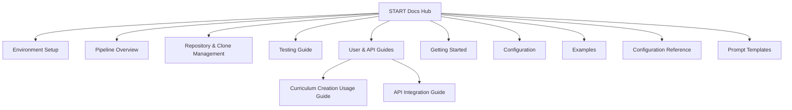

# START Project Documentation Hub

Welcome to the comprehensive documentation for the START (Scalable, Tailored Active-inference Research & Training) project - an advanced AI-powered system for creating personalized Active Inference and Free Energy Principle curricula.

## 🚀 **What is START?**

START is a complete educational content generation pipeline that combines:

- **Real-time research** using Perplexity API for current domain insights
- **Advanced LLM-based content generation** via OpenRouter for professional-quality curricula
- **Comprehensive personalization** tailored to specific learners and professional domains
- **Multilingual capabilities** with full cultural adaptation
- **Rich visualizations** including charts, diagrams, and interactive elements

## 📚 **Documentation Structure**



### Core Guides

#### 🛠️ **Setup & Development**

- **[Environment Setup](./environment.md)** - Complete installation, configuration, and development guide
  - Prerequisites, API setup, dependency management
  - Development workflow, testing, troubleshooting
  - IDE integration and advanced configuration

#### 🔄 **System Architecture**

- **[Pipeline Overview](./pipeline.md)** - Comprehensive system architecture and workflow
  - 4-stage curriculum creation pipeline
  - Configuration-driven research approach
  - API integration and content generation standards

#### 🔗 **External Integrations**

- **[Repository & Clone Management](./clones.md)** - External resource integration
  - Active Inference Institute ecosystem integration
  - Knowledge graph and implementation repositories
  - Educational resource enhancement strategies

### Specialized Documentation

#### 📖 **User Guides**

- **[Usage Guide](https://github.com/ActiveInferenceInstitute/Start/blob/main/learning/curriculum_creation/USAGE_GUIDE.md)**
- **[API Integration Guide](https://github.com/ActiveInferenceInstitute/Start/blob/main/learning/curriculum_creation/README.md)**

#### 🔧 **Configuration Reference**

- **Entity Configuration**: `data/config/entities.yaml` - Target learner profiles
- **Domain Configuration**: `data/config/domains.yaml` - Professional domain definitions
- **Language Configuration**: `data/config/languages.yaml` - Translation targets

#### 📝 **Prompt Engineering**

- **Domain Analysis Templates**: `data/prompts/research_domain_analysis.md`
- **Curriculum Generation Templates**: `data/prompts/research_domain_curriculum.md`
- **Personalization Templates**: `data/prompts/research_entity.md`
- **Translation Framework**: `data/prompts/translation.md`

## 🎯 **Quick Start Paths**

### For New Users

1. **[Environment Setup](./environment.md)** - Get up and running
2. **[Pipeline Overview](./pipeline.md)** - Understand the system
3. **[Usage Guide (GitHub)](https://github.com/ActiveInferenceInstitute/Start/blob/main/learning/curriculum_creation/USAGE_GUIDE.md)**

### For Developers

1. **[Environment Setup](./environment.md)** - Development environment
2. **[API Docs (GitHub)](https://github.com/ActiveInferenceInstitute/Start/blob/main/learning/curriculum_creation/README.md)**
3. **[Tests (GitHub)](https://github.com/ActiveInferenceInstitute/Start/tree/main/tests)**

### For Researchers

1. **[Pipeline Overview](./pipeline.md)** - Research capabilities
2. **[Clone Management](./clones.md)** - Access research repositories
3. **Configuration Files** - Customize research targets

## 🌐 **External Resources**

### Active Inference Institute Ecosystem

- **Institute website**: [activeinference.org](https://www.activeinference.org/)
- **Livestreams**: [activeinference.institute/livestreams](https://www.activeinference.institute/livestreams)
- **Courses**: [activeinference.institute/courses](https://www.activeinference.institute/courses)
- **Journal**: [Active Inference Journal](https://www.activeinference.org/research/journal)
- **Research resources**: [activeinference.org/research/resources](https://www.activeinference.org/research/resources)
- **Volunteer & internships**: [activeinference.org/education/volunteer](https://www.activeinference.org/education/volunteer)
- **Partnerships**: [activeinference.institute/partnership](https://www.activeinference.institute/partnership)
- **TNB Group (Theoretical Neurobiology)**: [activeinference.institute/tnb](https://www.activeinference.institute/tnb)
- **Welcome portal**: [welcome.activeinference.institute](https://welcome.activeinference.institute/)
- **Knowledge graph**: [obsidian.activeinference.institute](https://obsidian.activeinference.institute/)
- **Cognitive repository**: [ActiveInferenceInstitute/cognitive](https://github.com/ActiveInferenceInstitute/cognitive)

### Math & Programming Resources

- **pymdp (official)**: [infer-actively/pymdp](https://github.com/infer-actively/pymdp)
- **Active Inference Tutorial Scripts**: [rssmith33/Active-Inference-Tutorial-Scripts](https://github.com/rssmith33/Active-Inference-Tutorial-Scripts)
- **Free Energy Principle papers**: [activeinference.github.io](https://activeinference.github.io/)
- **Active Inference: Demystified and Compared**: [arXiv:1909.10863](https://arxiv.org/abs/1909.10863)
- **Step-by-Step Tutorial**: [PMC](https://pmc.ncbi.nlm.nih.gov/articles/PMC8956124/)

### In-Repo Entry Points

- **Top-level landing page**: [Here — starting at start/here](../here.md)
- **Other materials**: [docs/other/inferant_stream_015-1.md](./other/inferant_stream_015-1.md)

## 📋 **System Capabilities**

### Research & Analysis

- **16 Professional Domains**: Life sciences, technology, business, healthcare, education
- **8 Target Entities**: Political figures, scientists, tech leaders, educators
- **Real-time Research**: Current industry insights and professional analysis
- **Comprehensive Analysis**: 3,000-5,000 word domain reports

### Content Generation

- **Professional-Grade Curricula**: 40-60 hour structured learning programs
- **Personalized Learning**: 5,000-8,000 word tailored strategies
- **Modular Design**: 3-5 hour comprehensive learning units
- **Assessment Integration**: Built-in evaluation and progress tracking

### Visualization & Media

- **Data Visualizations**: PNG charts with curriculum metrics and analysis
- **Process Diagrams**: Mermaid diagrams for structure and flow
- **Interactive Elements**: Visual learning aids and conceptual frameworks

### Multilingual Support

- **9+ Languages**: Chinese, Spanish, Arabic, Hindi, French, Japanese, Russian, Swahili, Tagalog
- **Cultural Adaptation**: Full localization beyond literal translation
- **Professional Quality**: Native-speaker level fluency with technical accuracy

## 🔧 **Configuration Overview**

### Research Configuration

```yaml
# data/config/entities.yaml
entities:
  - name: "karl_friston"
    category: "scientist"
    priority: "high"

# data/config/domains.yaml
domains:
  - name: "biochemistry"
    category: "life_sciences"
    priority: "high"
```

### Command-Line Interface

```bash
# Research high-priority entities
python 1_Research_Entity.py --priority high

# Generate domain-specific curricula
python 1_Research_Domain.py --domain biochemistry

# Create multilingual content
python 4_Translate_Introductions.py --languages Spanish French
```

## 📊 **Project Structure**

```text
START/
├── src/                      # Core system implementation
├── learning/                 # Curriculum creation scripts
├── data/                     # Generated content and configuration
├── docs/                     # Comprehensive documentation
├── tests/                    # Test suite and validation
└── README.md                 # Project overview and quick start
```

## 🔄 **Development Workflow**

### Standard Development Cycle

1. **Configure targets** in `data/config/` YAML files
2. **Run research** using domain and entity scripts
3. **Generate curricula** with comprehensive content creation
4. **Create visualizations** for enhanced learning
5. **Translate content** for multilingual accessibility

### Quality Assurance

- **Comprehensive testing** with pytest and TDD approach
- **Code quality** with ruff linting and black formatting
- **API integration testing** for Perplexity and OpenRouter
- **Content validation** against Active Inference standards

## 📞 **Getting Help**

### Documentation Resources

- **This documentation hub** for comprehensive guides
- **Inline code documentation** with detailed docstrings
- **Example usage** in test files and usage guides
- **Configuration examples** in YAML files

### Community & Support

- **Active Inference Institute** for research questions
- **GitHub Issues** for technical problems and feature requests
- **Test Suite** for usage examples and validation patterns

---

**START** represents a new paradigm in educational content creation, combining cutting-edge AI research capabilities with comprehensive pedagogical design to produce world-class Active Inference curricula tailored to any professional domain or individual learner.
