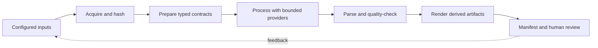

# Methods and Evidence Protocol

This document defines how START turns configured inputs into research,
curriculum, translation, and visualization artifacts. It is an engineering
methods record, not a claim that generated prose is independently verified
scholarship.

## Research question

Can a small, filesystem-first pipeline produce useful learning materials while
keeping execution state, evidence status, provenance, quality checks, and
reproducibility visible enough for a human to review before publication?

The answer is treated as an empirical engineering question. A successful run
is not the same thing as a true research claim: provider output still requires
source inspection and human judgment.

## First-principles reconstruction

### Hard constraints

Only these constraints are treated as immutable:

1. Bytes that are published must be identifiable, retrievable, and hashable.
2. A published artifact must not be presented as stronger evidence than its
   source and provenance support.
3. A failed required prerequisite must not produce a valid downstream bundle.
4. A resumed run must be able to distinguish an intact artifact from a changed
   or partial artifact.
5. A user-controlled path, URL, or provider response is untrusted input.

Policies such as “use a particular provider,” “keep timestamps in names,” and
“always render a PNG” are soft choices. START keeps them replaceable when they
conflict with the function being optimized.

### Function

The function is: **make reviewable learning artifacts from explicit inputs with
an inspectable evidence chain**. The implementation form is a modular,
filesystem-first pipeline because the current scale does not require a
database or a multi-user service.

### Reconstructed operating loop



Each stage records item identifiers, status, dependencies, errors, output
paths, hashes, usage, and provenance. Required-stage failure is fail-closed;
optional-stage failure remains visible rather than being silently discarded.

## Pre-registered engineering goals

Before a release claim, the following criteria are fixed:

- [ ] `uv run pytest -q` completes with no unexpected failures.
- [ ] Branch-aware coverage reaches the release floor configured by CI.
- [ ] Repository, type, dependency, shell, and strict documentation gates pass.
- [ ] Offline regeneration produces equivalent artifact content and manifest
      structure across two clean output directories.
- [ ] Every publication candidate has evidence status, source/provenance
      metadata, quality status, and a human-review decision.
- [ ] A bounded live pilot, if authorized, records its budget and is reviewed
      before any live output is published.

The checkboxes are release criteria, not evidence that the criteria have
already been met. Run the commands in [Testing](TESTING.md) to update them.

## Hypotheses and falsification tests

The project uses multiple hypotheses rather than optimizing around one favored
explanation:

| Hypothesis | Falsification test | Measurement |
| --- | --- | --- |
| H1: provenance metadata improves release decisions | Remove metadata from a fixture and require the publication validator to reject it | validator disposition and error class |
| H2: one canonical runner reduces behavior drift | Run a staged entrypoint and the canonical command on the same offline input | stage graph, item IDs, and manifest equivalence |
| H3: content-addressed artifact records make resume safe | Change or replace one output between attempts | resume must invalidate the affected stage and refuse stale publication |
| H4: stable IDs prevent naming collisions | Supply display names that normalize to the same slug | configuration validation must reject duplicate IDs or preserve distinct safe IDs |
| H5: visualization provenance improves interpretation | Change one curriculum input without changing the output directory | visualization manifest must show the changed input hash and derived artifacts |

These tests can disprove the implementation claims. They cannot establish that
generated educational prose is factually correct.

## Data and provenance model

START distinguishes at least these evidence states:

- `live`: obtained from an explicitly enabled provider request;
- `source_material`: copied or transformed from a named source artifact;
- `synthetic_foundation`: authored fixture material, including
  `Synthetic_FEP-ActInf.md`;
- `offline_fixture`: deterministic local test data;
- `derived_visualization`: computed from identified input artifacts;
- `unverified`: exploratory output without sufficient source evidence.

Every state is carried with the artifact or run manifest. Synthetic and
fallback material is never silently promoted to live evidence.

## Analysis and review protocol

1. Validate YAML and stable identifiers before provider calls.
2. Hash every source file and record provider/model/prompt metadata when a
   provider is used.
3. Parse provider responses into stage-specific contracts before writing the
   Markdown representation for review.
4. Apply structural quality checks: required sections, citations, language and
   script, translation parity, duplicate-content warnings, and length bounds.
5. Publish only regular files through atomic writes and record their hashes.
6. Review the run manifest and representative artifacts before publication.
7. Preserve raw inputs; archive or remove generated duplicates only through an
   explicit reviewed curation manifest.

## Reproducibility

The minimal offline experiment is:

```bash
uv run start-regenerate-offline --output-dir /tmp/start-offline-a --run-id protocol-a --json
uv run start-regenerate-offline --output-dir /tmp/start-offline-b --run-id protocol-b --json
uv run start-validate-outputs --root /tmp/start-offline-a --check
uv run start-validate-outputs --root /tmp/start-offline-b --check
```

Run directories are intentionally separate from publishable outputs. The
visualization stage also writes `visualization_manifest.json`, which binds
derived charts and diagrams to input hashes and states the semantic limit of
the visual summaries.

## Limitations and ethics

This tool does not independently verify provider claims, guarantee translation
quality, infer learner consent, or certify pedagogical effectiveness. Provider
content may be incomplete, biased, or wrong. A human remains responsible for
source review, publication, audience suitability, licensing, and any live
spend. The GUI is a convenience surface, not an authorization boundary.

## Iteration record

The improvement loop follows `OBSERVE → THINK → PLAN → BUILD → EXECUTE →
VERIFY → LEARN`. Each cycle must leave tests, documentation, generated
artifacts, or a bounded backlog change that another operator can inspect.
